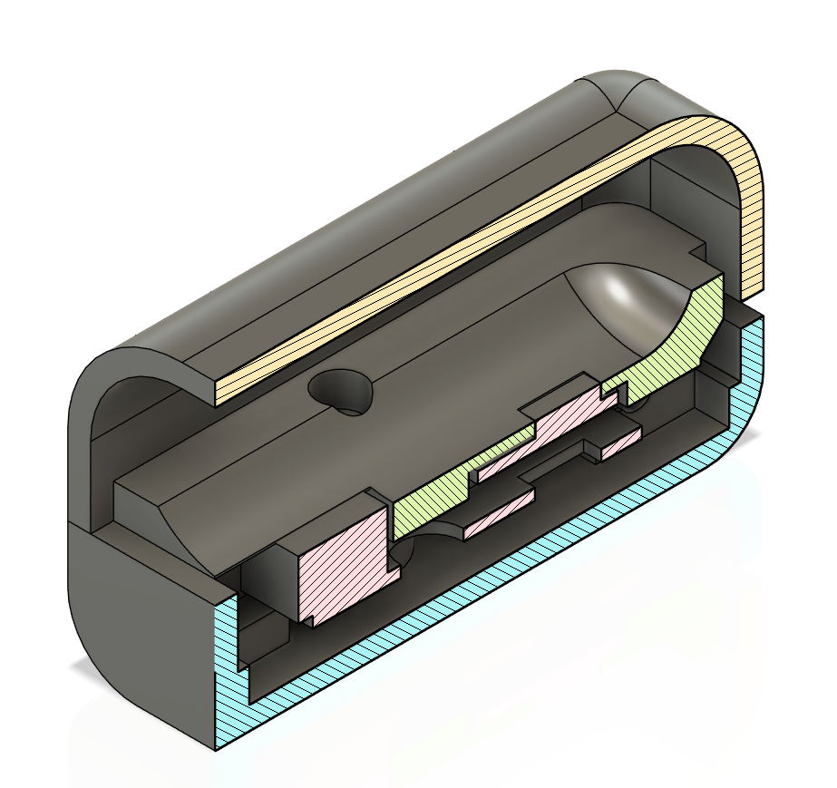

# MAX30100 based pulse Oxymeter for ROS4HC

This is the information required for building an inexpensive PPG sensor for ROS4HC using off the shelf parts:

- [Mini Heart Rate Unit (MAX30100)](https://shop.m5stack.com/products/mini-heart-unit)
- [M5StickC PLUS2 With accessories](https://shop.m5stack.com/products/m5stickc-plus2-with-watch-accessories)
