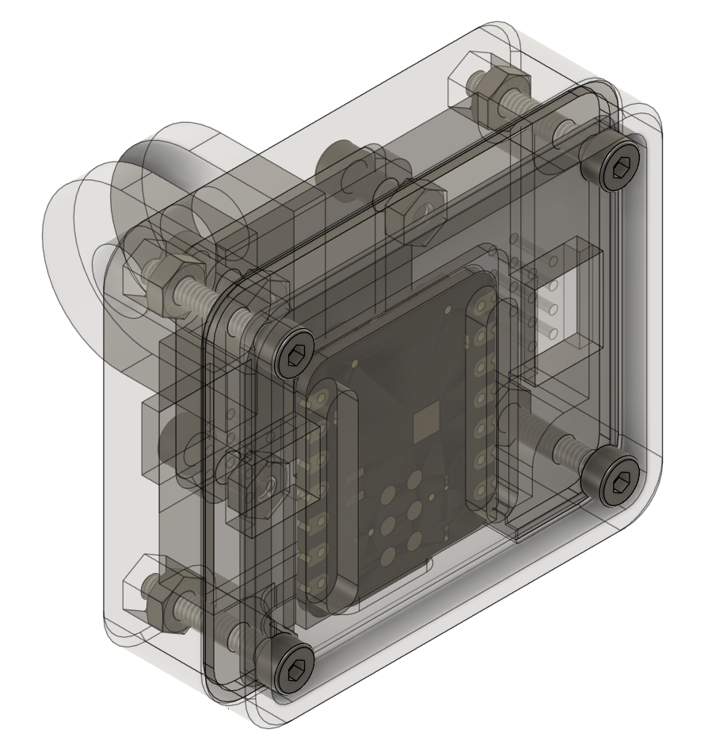

# Seeed Studio MHR60A mmWave sensor

This is the information required for building an inexpensive mmWave sensor for ROS4HC using off the shelf parts:

- [60GHz mmWave Radar Sensor](https://www.seeedstudio.com/60GHz-mmWave-Radar-Sensor-Breathing-and-Heartbeat-Module-p-5305.html)
- [Seeed Studio XIAO ESP32C3](https://www.seeedstudio.com/Seeed-Studio-XIAO-ESP32C3-Tape-Reel-p-6471.html)

These are the supporting files for the mmWave sensor, included are 3d files for a GoPro mount compatible case and a USB-serial converter based on the Seeed studio XIAO ESP32-C3

The original fusion files and step files are included for modification, the arduino code is the firmware used for the usb serial converter.

Finally the 3MF files for 3d printing are included, they can all be printed with standard FDM machines, tolerances are accounted for.
